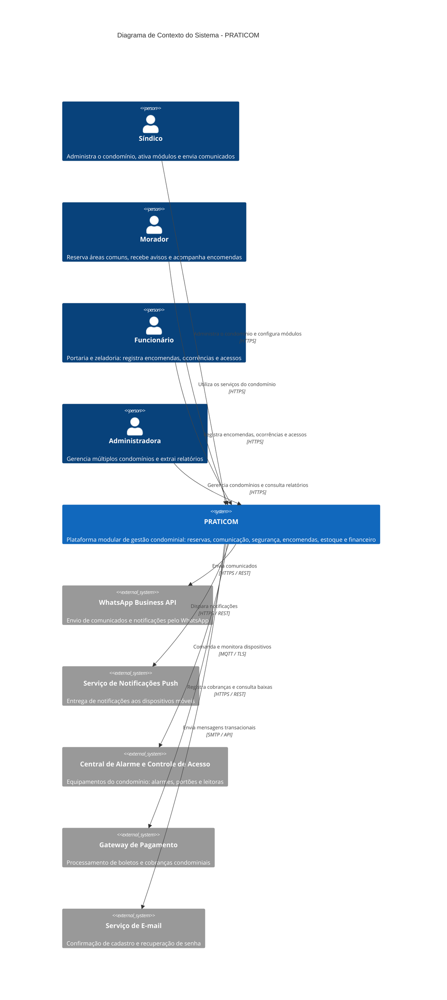
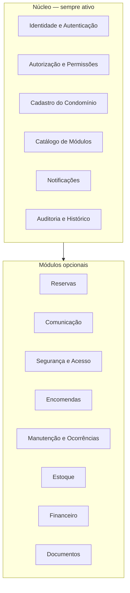
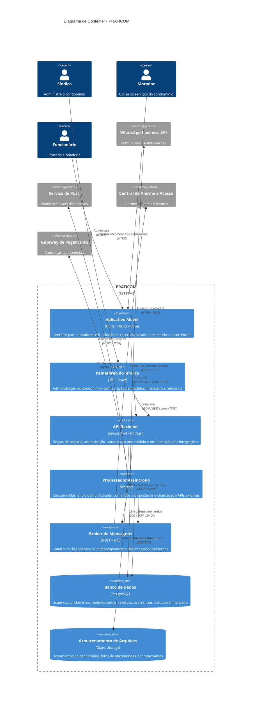

# PRATICOM — Documentação de Arquitetura

**Central digital de gestão condominial modular**

Documentação estruturada segundo o template [arc42](https://arc42.org) (seções 1 a 4) com diagramas do [C4 Model](https://c4model.com) níveis 1 e 2.

---

## Equipe

| Aluno |
| --- |
| Bruno Kioshi Sakaguchi |
| Gabriel Luan Cavalin |
| Heitor Massaroth de Farias |
| Priscila Bueno de Souza |
| Richard de Oliveira Kanheski |

**Disciplina:** Arquitetura de Software e Soluções em Cloud
**Documento:** Formativa 05 — Documentação de Arquitetura (arc42 + C4 Model)

---

## Sumário

1. [Introdução e Objetivos](#1-introdução-e-objetivos)
2. [Restrições da Arquitetura](#2-restrições-da-arquitetura)
3. [Escopo e Contexto do Sistema](#3-escopo-e-contexto-do-sistema)
4. [Estratégia de Solução](#4-estratégia-de-solução)

---

## 1. Introdução e Objetivos

O **PRATICOM** é um aplicativo de gestão condominial que centraliza, em uma única plataforma, os serviços hoje espalhados entre planilhas, grupos de mensagens, sistemas isolados e processos manuais.

O diferencial do produto é a **modularidade**: cada condomínio ativa apenas os módulos de que precisa (reservas, alarmes, encomendas, financeiro, estoque, etc.), pagando e operando somente aquilo que faz sentido para a sua realidade. Um condomínio pequeno pode usar apenas comunicados e reservas; um condomínio de grande porte pode habilitar o pacote completo, incluindo integrações com equipamentos de acesso e alarme.

### 1.1 Visão Geral dos Requisitos

**Problema.** A administração condominial é fragmentada. O síndico gerencia reservas em papel ou planilha, comunicados em grupos de WhatsApp, encomendas em caderno na portaria e finanças em sistemas de terceiros. Não há histórico consolidado, rastreabilidade nem transparência para o morador.

**Solução.** Um aplicativo único que funciona como *central do condomínio*, com painel administrativo para o síndico e aplicativo para o morador, sustentado por um catálogo de módulos ativáveis.

#### Requisitos Funcionais

| ID | Requisito | Descrição | Módulo |
| --- | --- | --- | --- |
| RF01 | Cadastro de usuário | Cadastro de síndicos, moradores, funcionários e administradores | Núcleo |
| RF02 | Login | Autenticação por e-mail, telefone ou outro método | Núcleo |
| RF03 | Cadastro do condomínio | Cadastro e edição das informações do condomínio | Núcleo |
| RF04 | Gerenciamento de módulos | Ativação e desativação de módulos pelo síndico | Núcleo |
| RF05 | Controle de permissões | Definição de quais funções cada perfil de usuário pode acessar | Núcleo |
| RF06 | Painel do síndico | Painel consolidado com as principais informações e funções | Núcleo |
| RF07 | Histórico de atividades | Registro de ações relevantes (aberturas de portão, reservas, alterações) | Núcleo |
| RF08 | Notificações | Envio de notificações sobre reservas, comunicados e autorizações | Núcleo |
| RF09 | Reserva de áreas comuns | Reserva de salão de festas, piscina, churrasqueira e demais espaços | Reservas |
| RF10 | Comunicados e avisos | Envio de comunicados do síndico aos moradores | Comunicação |
| RF11 | Integração com WhatsApp | Envio de comunicados e notificações selecionados via WhatsApp | Comunicação |
| RF12 | Enquetes | Criação de enquetes para votação dos moradores | Comunicação |
| RF13 | Gerenciamento de documentos | Disponibilização de documentos do condomínio aos moradores | Documentos |
| RF14 | Solicitação de manutenção | Registro e acompanhamento de solicitações de manutenção | Manutenção |
| RF15 | Registro de ocorrências | Registro de ocorrências por moradores e funcionários | Manutenção |
| RF16 | Acompanhamento de ocorrências | Atualização e encerramento das ocorrências registradas | Manutenção |
| RF17 | Controle de alarmes | Integração e acionamento de alarmes compatíveis com a plataforma | Segurança |
| RF18 | Controle de acesso | Registro e controle de entrada e saída de funcionários | Segurança |
| RF19 | Cadastro de prestadores | Cadastro de prestadores de serviço e autorizações de acesso | Segurança |
| RF20 | Cadastro de veículos | Cadastro de veículos vinculados a moradores e unidades | Segurança |
| RF21 | Gestão de encomendas | Registro de encomendas recebidas e notificação do destinatário | Encomendas |
| RF22 | Retirada de encomendas | Registro da retirada pelo morador ou pessoa autorizada | Encomendas |
| RF23 | Controle de estoque | Cadastro de produtos, entradas, saídas e saldo disponível | Estoque |
| RF24 | Controle financeiro | Registro de receitas, despesas e movimentações financeiras | Financeiro |
| RF25 | Relatórios financeiros | Geração de relatórios de receitas, despesas e movimentações | Financeiro |

### 1.2 Metas de Qualidade

As cinco metas abaixo dirigem as decisões arquiteturais deste documento, em ordem de prioridade.

| Nº | Meta de qualidade | Motivação |
| --- | --- | --- |
| Q1 | **Modularidade / Flexibilidade** | Cada condomínio ativa apenas os módulos desejados. A arquitetura deve permitir habilitar, desabilitar e evoluir módulos sem impacto sobre os demais nem sobre outros clientes. |
| Q2 | **Segurança e privacidade** | O sistema trata dados pessoais (CPF, endereço, veículos, imagens de acesso) e comanda dispositivos físicos como portões e alarmes. Conformidade com a LGPD e isolamento entre condomínios são inegociáveis. |
| Q3 | **Usabilidade** | O público inclui moradores idosos e síndicos sem formação técnica. Tarefas frequentes — reservar o salão, liberar um visitante, ver um comunicado — devem ser executáveis em poucos toques. |
| Q4 | **Disponibilidade** | Funções de segurança e controle de acesso são usadas 24×7. Indisponibilidade impede a entrada de moradores ou o acionamento de alarmes. |
| Q5 | **Integrabilidade** | O sistema conversa com centrais de alarme, controladoras de acesso, WhatsApp Business API e gateways de pagamento. As integrações devem ser plugáveis e falhar de forma isolada. |

### 1.3 Partes Interessadas (*Stakeholders*)

| Papel | Expectativa / Interesse |
| --- | --- |
| **Síndico** | Administrar o condomínio a partir de um único painel; escolher os módulos que utilizará; ter histórico e rastreabilidade das ações. |
| **Morador** | Reservar áreas comuns, receber comunicados, acompanhar encomendas e solicitar manutenção pelo celular, sem burocracia. |
| **Funcionário (portaria/zeladoria)** | Registrar encomendas, ocorrências e entradas/saídas de forma rápida durante o turno. |
| **Administradora de condomínios** | Gerenciar múltiplos condomínios na mesma plataforma e extrair relatórios consolidados. |
| **Equipe de desenvolvimento** | Ter uma arquitetura clara e modular, que permita evoluir um módulo sem quebrar os demais. |
| **Encarregado de dados (DPO)** | Garantir a conformidade do tratamento de dados pessoais com a LGPD (Lei 13.709/2018). |
| **Docente da disciplina** | Avaliar a coerência entre requisitos, decisões arquiteturais e documentação. |

---

## 2. Restrições da Arquitetura

### 2.1 Restrições Técnicas

| ID | Restrição | Motivação |
| --- | --- | --- |
| RT01 | **Aplicativo móvel multiplataforma (Android e iOS)** | O morador é usuário majoritariamente móvel. Manter duas bases nativas é inviável para a equipe, o que aponta para um framework multiplataforma (Flutter ou React Native). |
| RT02 | **API REST sobre HTTPS, independente de cliente** | O backend deve servir simultaneamente ao app móvel, ao painel web e a integrações externas, sem acoplamento a um framework de frontend específico. |
| RT03 | **Hospedagem em nuvem pública** | A equipe não mantém infraestrutura física. O modelo de nuvem viabiliza elasticidade e reduz o custo inicial. |
| RT04 | **Banco de dados relacional** | O domínio é fortemente transacional e relacional (unidades, reservas, lançamentos financeiros), exigindo integridade referencial e transações ACID. |
| RT05 | **Protocolo MQTT para dispositivos IoT** | Centrais de alarme e controladoras de acesso operam em redes instáveis e com pouca capacidade de processamento; MQTT é o padrão de fato nesse cenário. |
| RT06 | **Integração com WhatsApp restrita à API oficial** | O uso de bibliotecas não oficiais viola os termos de serviço da Meta e expõe o produto a bloqueio. |
| RT07 | **Tecnologias de código aberto ou com camada gratuita** | Projeto acadêmico sem orçamento; toda dependência deve ser reproduzível pelos integrantes da equipe. |

### 2.2 Restrições Organizacionais

| ID | Restrição | Motivação |
| --- | --- | --- |
| RO01 | **Equipe de cinco estudantes** | Capacidade de desenvolvimento limitada; escopo entregue por incrementos, priorizando o núcleo e os módulos de maior valor. |
| RO02 | **Prazo do semestre letivo** | Entregas atreladas ao calendário das atividades formativas da disciplina. |
| RO03 | **Controle de versão em repositório Git** | Rastreabilidade das contribuições individuais e histórico de evolução do projeto. |
| RO04 | **Documentação como parte do entregável** | A arquitetura é avaliada pela documentação, não apenas pelo código. |

### 2.3 Convenções

| Convenção | Descrição |
| --- | --- |
| **Documentação de arquitetura** | Template arc42, escrito em Markdown e versionado junto ao código. |
| **Diagramas** | C4 Model (níveis 1 e 2) descritos em Mermaid, no próprio arquivo Markdown, permitindo revisão via *diff*. |
| **Idioma** | Português na documentação e na interface; inglês na nomenclatura de código, APIs e banco de dados. |
| **Nomenclatura de APIs** | Recursos REST no plural, em inglês e minúsculas (`/api/v1/reservations`), com versionamento no caminho. |
| **Conformidade legal** | Todo tratamento de dado pessoal segue os princípios da LGPD, com destaque para minimização e finalidade específica. |

---

## 3. Escopo e Contexto do Sistema

Esta seção delimita a fronteira do PRATICOM: quem o utiliza, com quais sistemas externos ele se comunica e por quais interfaces.

### 3.1 Contexto de Negócio

#### Diagrama de Contexto do Sistema — C4 Nível 1

#### Atores e Sistemas Externos

| Parceiro de comunicação | Entradas | Saídas |
| --- | --- | --- |
| **Síndico** | Cadastro do condomínio, ativação de módulos, comunicados, lançamentos financeiros | Painel administrativo, relatórios, histórico de atividades |
| **Morador** | Solicitações de reserva, pedidos de manutenção, ocorrências, votos em enquetes | Avisos, confirmações, status de encomendas e documentos |
| **Funcionário** | Registro de encomendas, ocorrências e entradas/saídas | Lista de tarefas, autorizações de acesso pendentes |
| **Administradora** | Cadastro de condomínios e usuários administrativos | Relatórios consolidados de múltiplos condomínios |
| **WhatsApp Business API** | — | Comunicados e notificações enviados aos moradores |
| **Serviço de notificações push** | — | Notificações entregues aos aplicativos móveis |
| **Central de alarme e controle de acesso** | Eventos de abertura, alarme disparado, status dos dispositivos | Comandos de armar/desarmar e abrir portão |
| **Gateway de pagamento** | Confirmações de pagamento (*webhooks*) | Solicitações de emissão de cobrança |
| **Serviço de e-mail** | — | Mensagens de confirmação e recuperação de acesso |

### 3.2 Contexto Técnico

| Interface | Canal / Protocolo | Formato | Observação |
| --- | --- | --- | --- |
| Aplicativo móvel ↔ Backend | HTTPS (TLS 1.2+) | JSON / REST | Autenticação por token JWT com expiração curta |
| Painel web ↔ Backend | HTTPS (TLS 1.2+) | JSON / REST | Mesma API consumida pelo aplicativo móvel |
| Backend ↔ Dispositivos IoT | MQTT sobre TLS | JSON | Broker interno; dispositivos autenticados individualmente |
| Backend ↔ WhatsApp | HTTPS | JSON / REST | API oficial Meta; envio assíncrono via fila |
| Backend ↔ Push | HTTPS | JSON / REST | Tokens de dispositivo registrados no cadastro do usuário |
| Backend ↔ Gateway de pagamento | HTTPS | JSON / REST + *webhook* | Retorno de baixa processado de forma assíncrona |
| Backend ↔ Banco de dados | TCP (rede privada) | SQL | Acesso restrito à VPC, sem exposição pública |
| Backend ↔ Armazenamento de arquivos | HTTPS | Objetos binários | Documentos, fotos de encomendas e comprovantes |

**Fora do escopo.** Não fazem parte do sistema: a emissão fiscal contábil do condomínio, a integração com sistemas contábeis de terceiros, o fornecimento ou a instalação do hardware de alarme e controle de acesso, e o processamento financeiro em si (delegado ao gateway).

---

## 4. Estratégia de Solução

Esta seção conecta as metas de qualidade da seção 1.2 às decisões arquiteturais fundamentais.

### 4.1 Decisões Tecnológicas Fundamentais

| Decisão | Escolha | Justificativa |
| --- | --- | --- |
| **Estilo arquitetural** | Monolito modular com fronteiras explícitas entre módulos | Atende à meta Q1 sem impor o custo operacional de microsserviços a uma equipe de cinco pessoas. As fronteiras internas preservam o caminho de extração futura de módulos. |
| **Multi-tenancy** | Base de dados compartilhada com isolamento lógico por `condominio_id` | Reduz custo e simplifica a operação. O isolamento é imposto na camada de acesso a dados, nunca deixado a critério de cada consulta (Q2). |
| **Frontend móvel** | Framework multiplataforma (Flutter ou React Native) | Uma base de código para Android e iOS (RT01), essencial dado o tamanho da equipe. |
| **Frontend web** | Aplicação de página única (SPA) para o painel do síndico | Telas administrativas densas — relatórios, financeiro, configuração de módulos — funcionam melhor em tela grande. |
| **Backend** | API REST em Java/Spring Boot ou Node.js | Ecossistema maduro, forte suporte a segurança e familiaridade da equipe (RT02). |
| **Banco de dados** | PostgreSQL | Transações ACID e integridade referencial para reservas e lançamentos financeiros (RT04). |
| **Mensageria** | Broker MQTT para IoT + fila de tarefas para integrações externas | Desacopla o comando ao dispositivo e o envio de mensagens do ciclo de requisição/resposta (Q4, Q5). |
| **Armazenamento de arquivos** | Serviço de armazenamento de objetos | Documentos e imagens não devem trafegar pelo banco relacional; permite URLs assinadas com expiração. |
| **Autenticação** | JWT de curta duração + *refresh token*; RBAC por perfil e por módulo ativo | Uma permissão só é concedida se o perfil a possui **e** o módulo está ativo naquele condomínio (Q1 + Q2). |

### 4.2 Decisões de Organização Modular

O sistema divide-se em um **núcleo obrigatório** e um **catálogo de módulos opcionais**.

O núcleo concentra identidade, autorização, cadastro do condomínio, catálogo de módulos, notificações e auditoria. Ele é sempre ativo e é o único componente do qual os demais podem depender. **Módulos não se comunicam diretamente entre si**: quando precisam reagir a algo que ocorreu em outro módulo, fazem-no por meio de eventos de domínio publicados no núcleo. Essa regra é o que torna possível desligar um módulo sem quebrar os demais — a condição direta para atender à meta Q1.

### 4.3 Decisões para Alcançar as Metas de Qualidade

| Meta | Abordagem arquitetural |
| --- | --- |
| **Q1 — Modularidade** | Catálogo de módulos persistido por condomínio; verificação de módulo ativo no *middleware* de autorização; comunicação entre módulos exclusivamente por eventos de domínio. |
| **Q2 — Segurança e privacidade** | TLS obrigatório em todas as interfaces; filtro de `condominio_id` aplicado na camada de repositório; trilha de auditoria imutável para ações sensíveis; dados pessoais minimizados e com política de retenção definida; segredos e tokens fora do código-fonte. |
| **Q3 — Usabilidade** | Interface do morador restrita aos módulos ativos, sem menus mortos; fluxos críticos (reserva, liberação de visitante) em no máximo três toques; notificações push com ação direta. |
| **Q4 — Disponibilidade** | Backend sem estado, permitindo múltiplas instâncias atrás de balanceador; operações com dispositivos físicos processadas de forma assíncrona com repetição automática; degradação graciosa — a falha de uma integração externa não derruba o restante do sistema. |
| **Q5 — Integrabilidade** | Integrações externas encapsuladas em adaptadores com interface própria; chamadas externas enfileiradas com política de repetição e *dead letter*; contrato de API versionado. |

### 4.4 Diagrama de Contêiner — C4 Nível 2

> **Nota.** Neste diagrama, *contêiner* designa uma unidade executável ou de armazenamento com ciclo de vida próprio, conforme o C4 Model. O termo não se refere a Docker ou Kubernetes.

#### Descrição dos Contêineres

| Contêiner | Tecnologia | Responsabilidade |
| --- | --- | --- |
| **Aplicativo Móvel** | Flutter ou React Native | Interface principal de moradores e funcionários. Exibe apenas os módulos ativos no condomínio do usuário. |
| **Painel Web do Síndico** | SPA em React | Administração do condomínio: ativação de módulos, comunicados, financeiro, relatórios e permissões. |
| **API Backend** | Spring Boot ou Node.js | Núcleo do sistema. Concentra as regras de negócio, valida perfil e módulo ativo a cada requisição, e é o único componente com acesso direto ao banco. |
| **Processador Assíncrono** | Worker | Executa tudo que não pode bloquear a requisição do usuário: envio de mensagens, comandos a dispositivos e chamadas a APIs externas, com repetição em caso de falha. |
| **Broker de Mensagens** | MQTT + fila de tarefas | Canal de comunicação com os dispositivos do condomínio e barreira de desacoplamento entre a API e as integrações externas. |
| **Banco de Dados** | PostgreSQL | Persistência transacional de todo o domínio, com isolamento lógico por condomínio. |
| **Armazenamento de Arquivos** | Object Storage | Guarda arquivos binários fora do banco relacional, servidos por URLs assinadas com expiração. |

### 4.5 Decisões Organizacionais

| Decisão | Descrição |
| --- | --- |
| **Entrega incremental** | O núcleo é construído primeiro; os módulos são incorporados por ordem de valor percebido — Reservas e Comunicação antes de Financeiro e Segurança. |
| **Divisão do trabalho por módulo** | A fronteira modular da arquitetura é também a fronteira de trabalho da equipe, reduzindo conflitos de integração. |
| **Documentação versionada** | Este documento evolui junto ao código no mesmo repositório, com os diagramas em Mermaid revisáveis por *diff*. |
| **Registro de decisões** | Decisões arquiteturais relevantes são registradas em ADRs contendo contexto, alternativas consideradas e consequências. |

---

## Referências

- [arc42 — Template de documentação de arquitetura](https://arc42.org)
- [C4 Model — Simon Brown](https://c4model.com)
- [Mermaid — Diagramas C4](https://mermaid.js.org/syntax/c4.html)
- [Exemplo de referência: biking2 (Michael Simons)](https://biking.michael-simons.eu/docs/index.html)
- Lei nº 13.709/2018 — Lei Geral de Proteção de Dados Pessoais (LGPD)
